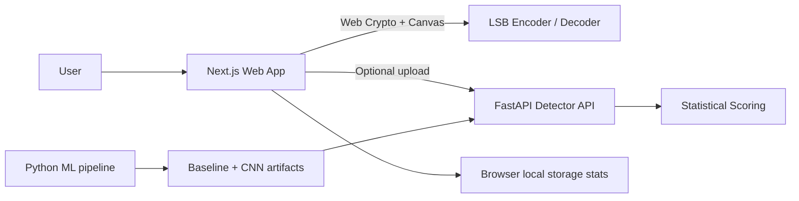

# PixelVault Architecture

## Overview

## Layers

- Presentation: Next.js App Router pages and reusable client components.
- Core engine: browser-side encryption, payload formatting, PNG steganography, and image comparison.
- Optional backend: FastAPI image analysis and model metadata endpoints.
- ML pipeline: Python dataset generation, feature extraction, model training, calibration, and export.

## Design Principles

- Keep the hide/extract path usable without a backend.
- Avoid permanent storage of user uploads or secrets.
- Keep the detector honest about uncertainty and limitations.
